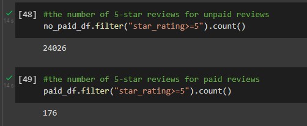
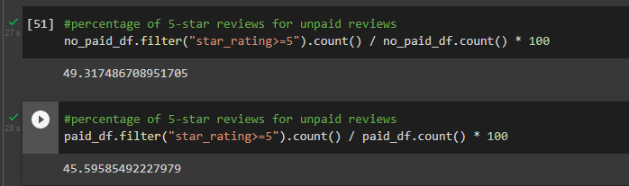

# Amazon_Vine_Analysis

## Overview of the analysis
The Amazon Vine program is a service to giver user feedback to suppliers. 
Example:SellBy pay's fee to Amazon and offers products in exchange for a published review.  

Utilizing approximately 50 datasets, each containing specific product reviews from clothing apparel to wireless products. PySpark is utilized to perform ETL process to extract, transform, connect and load data from Amazon S3 bucket into pgAdmin. The key role of PySpark is in determining positivity bias from Vine members.

Software; PySpark 

## Results

What is the number of Vine reviews vs. non-Vine reviews?
Given total=49,103 only 386 are in the vine program. Vine users represent about 0.78% of overall reviews.

- How many Vine reviews were 5 stars? How many non-Vine reviews were 5 stars?

- What percentage of Vine reviews were 5 stars? What percentage of non-Vine reviews were 5 stars?

## Summary

Conclusion: Vine progran had little impact in lawn and garden products given a mere 0.78% of the total reviews. No positivity bias trend was found from vine to non-vine users given 5 star ratings from the two groups:
Unpaid - 49% of the Unpaid users
Paid - 45%  of Vine users
This means non-vine (unpaid) users had a higher proportion of 5-star ratings.

